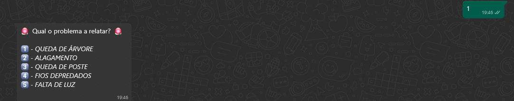
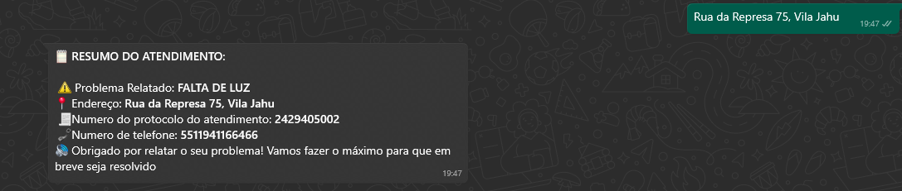

# Whatsapp Bot with VENOM-BOT

## Descrição do Projeto

<p align="center"></p> <h1 align="center"> <a href="https://nodejs.org/en/">🔗 NodeJS</a> <a href="https://www.npmjs.com/package/venom-bot">🧠 Venom Bot</a> </h1> <p align="center">🚀 Este projeto criado para auxiliar empresas de energia a localizar e resolver problemas relatados por seus clientes via WhatsApp.</p> <br> <h1 align="center">       </h1>

### 🔎 Objetivo
O objetivo deste bot é facilitar o processo de identificação de problemas relacionados a quedas de energia, alagamentos, fios depredados, entre outros, através de um fluxo automatizado e eficiente no WhatsApp. O bot também permite que as empresas de energia atuem rapidamente na solução das demandas, armazenando as informações dos usuários em um banco de dados Oracle.

### 💎 Funcionalidades
●Relatar problemas como falta de energia, queda de poste, fios depredados, e mais.
●Coletar informações do usuário, como endereço e telefone.
●Gerar um número de protocolo único para cada atendimento.
●Armazenar os dados coletados (problema, endereço, número de telefone, protocolo) em um banco de dados Oracle para posterior análise e resolução.


### ⏳ Pré-requisitos
Antes de começar, você vai precisar ter instalado em sua máquina as seguintes ferramentas: Git, Node.js, Banco de dados configurado. Além disto, é bom ter um editor para trabalhar com o código como VSCode.

### 🎲 Rodando nossa aplicação

```bash
# Clone este repositório
$ git clone 

# Instale as dependências
$ npm install

# Execute a aplicação em modo de desenvolvimento
$ npm run dev

## Pronto, escaneie o código QR do Whatsapp e Voilà, aproveite!
```

### 🛠 Tecnologias

As seguintes ferramentas foram usadas na construção do projeto:

- [Node.js](https://nodejs.org/en/)
- [Venom-Bot](https://www.npmjs.com/package/venom-bot/v/2.0.7)
- [Oracle DataBase](https://www.oracle.com/br/)

### Autor

---

by 
[Gustavo Pasqualetti](https://github.com/GustavoPasqualetti) 👋🏽 
[Eduardo Pasqualetti](https://github.com/EduardoPasqualetti) 👋🏽
[Gustavo Alves Correa](https://github.com/GustavoAlvesCorrea) 👋🏽